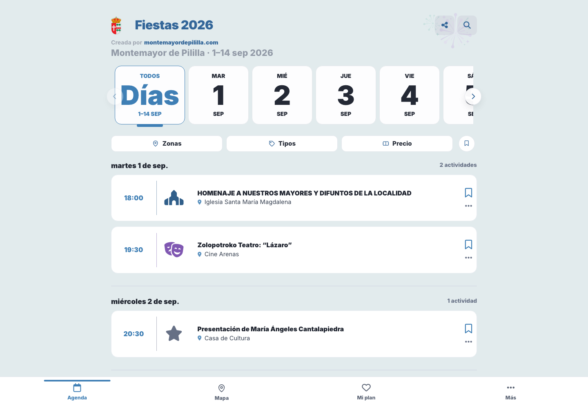
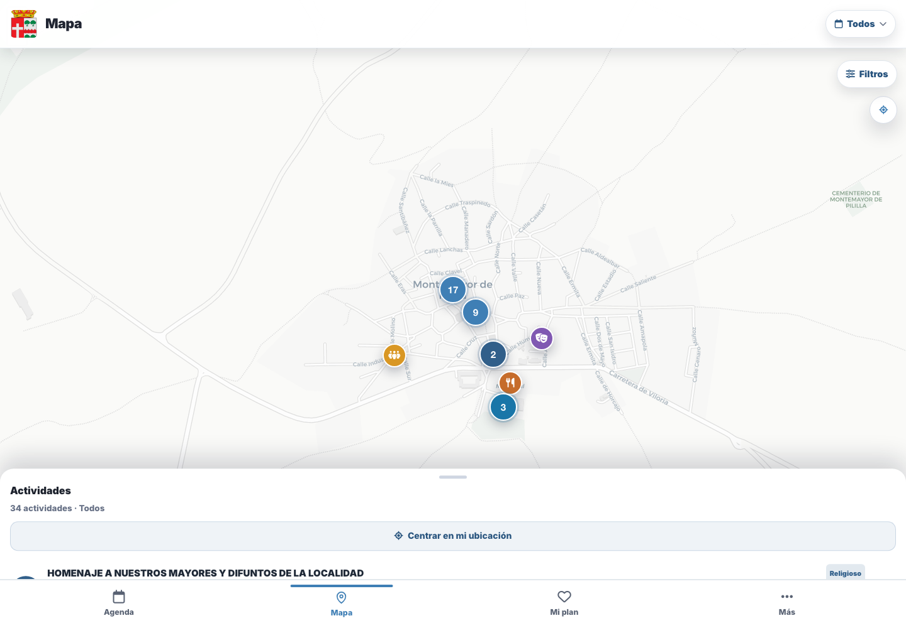
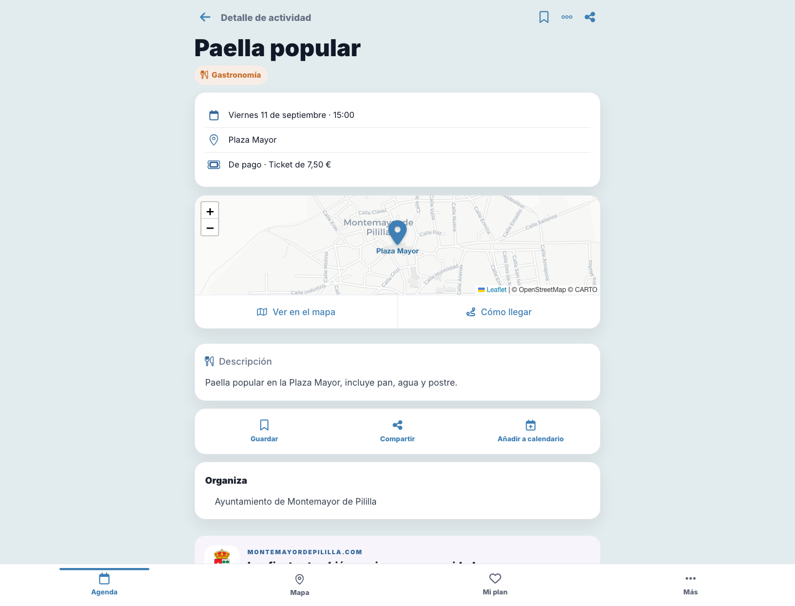

# Fiestas 2026 · Montemayor de Pililla

[Fiestas 2026](https://fiestas.montemayordepililla.com/) es una agenda web creada por `montemayordepililla.com` para las Fiestas Mayores de Montemayor de Pililla 2026. `montemayordepililla.com` es una web independiente del Ayuntamiento, creada por vecinos en 2002.

La web de producción concentra el programa en una experiencia sencilla para consultar qué ocurre cada día, dónde, cómo llegar y qué actividades merece la pena guardar.

## Vista rápida en móvil

Las tres pantallas principales de la aplicación:

<table>
  <tr>
    <td align="center" valign="top"><strong>Agenda</strong> </td>
    <td align="center" valign="top"><strong>Mapa</strong> </td>
    <td align="center" valign="top"><strong>Detalle</strong> </td>
  </tr>
</table>

## La aplicación

La aplicación permite:

- consultar la agenda por días y horarios;
- buscar actividades por texto;
- filtrar por tipo, zona, precio y actividades guardadas;
- cambiar entre agenda y mapa;
- abrir una ficha completa de cada actividad;
- consultar ubicación, coordenadas, entradas, organizadores y descripción;
- abrir indicaciones y añadir actividades al calendario;
- guardar favoritos y organizar planes personalizados;
- exportar, compartir e importar planes;
- explorar planes públicos preparados por la comunidad;
- compartir actividades y la agenda;
- instalar la web como PWA y consultar contenido visitado sin conexión;
- cambiar entre tema claro y oscuro;
- suscribirse al calendario ICS y al RSS propios de esta agenda.

Los favoritos y planes personales se guardan localmente en el navegador. No requieren cuenta y no se sincronizan con un servidor.

## Web de producción

La web se publica en:

~~~text
https://fiestas.montemayordepililla.com/
~~~

Sus principales rutas son:

| Ruta | Uso |
| --- | --- |
| <code>/</code> | Agenda principal. |
| <code>/mapa/</code> | Mapa de actividades con coordenadas. |
| <code>/e/&lt;id&gt;/&lt;slug&gt;/</code> | Ficha permanente de una actividad. |
| <code>/plan/</code> | Favoritos y planes personales del navegador. |
| <code>/plan/importar/</code> | Importación de planes compartidos. |
| <code>/planes/</code> | Planes públicos de la comunidad. |
| <code>/planes/&lt;id&gt;/</code> | Ficha de un plan público. |

La producción es una web estática: el contenido se genera en <code>dist/</code>, se escribe <code>dist/CNAME</code> con <code>fiestas.montemayordepililla.com</code> y se publica mediante GitHub Pages. El workflow de [deploy-pages.yml](.github/workflows/deploy-pages.yml) construye y despliega el sitio en cada push a la rama <code>fiestasmonte26</code> (y también permite lanzarlo manualmente desde esa rama).

La agenda enlaza con la web vecinal principal de [Montemayor de Pililla](https://www.montemayordepililla.com/), sus avisos oficiales en [Bandomovil](https://www.bandomovil.com/montemayordepililla) y sus canales locales. La información oficial del programa se conserva como referencia en [Bandomovil](https://montemayordepililla.bandomovil.com/comunicado.php?id=1628854).

El logotipo usa el [escudo de Montemayor de Pililla de Wikimedia Commons](https://commons.wikimedia.org/wiki/File:Escudo_de_Montemayor_de_Pililla.svg), obra de Rastrojo, con licencia [CC BY-SA 4.0](https://creativecommons.org/licenses/by-sa/4.0/). La web incluye una versión SVG para el logo y un PNG de 32 × 32 píxeles para el favicon.

El preview para redes se genera en <code>src/assets/social/fiestas-montemayor-2026.jpg</code> con formato Open Graph de 1200 × 630 píxeles.
La composición usa como referencia fotográfica la [Iglesia de Santa María Magdalena](https://www.tuscasasrurales.com/img-guias-viaje/valladolid/montemayor-de-pililla/max/iglesia-de-santa-maria-magdalena.jpg) y el escudo oficial indicado arriba.

## Estructura técnica

El proyecto separa los datos, la generación de páginas y el comportamiento del navegador:

| Parte | Responsabilidad |
| --- | --- |
| <code>src/data/</code> | Programa de actividades y catálogo de planes públicos. |
| <code>src/templates/</code> | Plantillas Nunjucks para agenda, mapa, fichas y planes. |
| <code>src/styles/</code> | CSS de la aplicación, procesado con Tailwind, PostCSS y Autoprefixer. |
| <code>src/scripts/</code> | Módulos ES del navegador: agenda, filtros, mapa, favoritos, planes, PWA, tema y analítica. |
| <code>src/assets/</code> | Imágenes, iconos, manifest y recursos editoriales. |
| <code>src/pwa/</code> | Service worker y página offline. |
| <code>scripts/build.mjs</code> | Generador estático que valida datos y escribe <code>dist/</code>. |
| <code>scripts/dev.mjs</code> | Servidor local con build inicial y reconstrucción al cambiar <code>src/</code>. |
| <code>tests/</code> | Pruebas automatizadas del código JavaScript. |

El navegador recibe HTML ya generado y módulos JavaScript que añaden la interacción. El mapa carga Leaflet bajo demanda. Los recursos propios de CSS y JavaScript se publican con versiones derivadas de su contenido para evitar problemas de caché.

La fuente principal de actividades es:

~~~text
src/data/fiestas-2026/events.json
~~~

Cada actividad tiene un ID numérico estable. El build genera su slug, su URL, sus metadatos sociales y, cuando hay coordenadas, sus enlaces de mapa. Los planes públicos se definen en <code>src/data/community-plans.json</code> y sus archivos se guardan en <code>src/data/community-plans/</code>.

## Desarrollo local

La instalación, el servidor local, las pruebas, el build, la auditoría de ubicaciones y las opciones de configuración están documentados en:

[Guía de desarrollo local](docs/local-development.md)

## Licencia

El contenido aportado al repositorio se publica bajo [CC BY-SA 4.0](https://creativecommons.org/licenses/by-sa/4.0/deed.es). El código está disponible en [GitHub](https://github.com/nukeador/fiestasmonte).
